# ☁️ AWS Cloud Infrastructure Lab

> Builds a production-style cloud infrastructure on **Amazon Web Services**
> using the AWS Free Tier — covering networking, compute, storage, monitoring,
> and security across both Windows and Linux environments.
> Extends the existing on-premises `InfoTech.com` homelab into a second cloud platform,
> making the environment truly hybrid and cloud-agnostic.

<div align="center">


</div>

---

## 📌 Overview

AWS is the most widely used cloud platform in the Canadian job market.
This project builds a complete cloud infrastructure environment from scratch —
covering the core AWS services that appear in every IT, sysadmin, and
cloud support role: identity, networking, compute, storage, and monitoring.

**What this project demonstrates:**

- Designing and deploying a custom VPC with public and private subnets
- Launching and managing Windows Server and Linux EC2 instances
- Configuring IAM users, groups, roles, and least-privilege policies
- Managing S3 storage with bucket policies, versioning, and lifecycle rules
- Setting up CloudWatch monitoring with alarms and log groups
- Hardening the AWS environment following security best practices

---

## 🏗️ Architecture

```
┌──────────────────────────────────────────────────────────────────┐
│                        AWS Cloud (Free Tier)                     │
│                                                                  │
│   ┌──────────────────────────────────────────────────────────┐  │
│   │                  Custom VPC (10.0.0.0/16)                │  │
│   │                                                          │  │
│   │   ┌─────────────────┐    ┌─────────────────┐            │  │
│   │   │  Public Subnet  │    │  Private Subnet  │            │  │
│   │   │  10.0.1.0/24   │    │  10.0.2.0/24    │            │  │
│   │   │                 │    │                  │            │  │
│   │   │  EC2 Windows    │    │  EC2 Linux       │            │  │
│   │   │  (RDP port 3389)│    │  (SSH port 22)   │            │  │
│   │   └────────┬────────┘    └─────────┬────────┘            │  │
│   │            │                       │                      │  │
│   │   Internet Gateway          NAT Gateway                   │  │
│   └────────────┼───────────────────────┼──────────────────────┘  │
│                │                       │                         │
│   ┌────────────▼───────────────────────▼──────────────────────┐  │
│   │                    Other AWS Services                      │  │
│   │    S3 Buckets    CloudWatch    IAM    Security Hub         │  │
│   └────────────────────────────────────────────────────────────┘  │
└──────────────────────────────────────────────────────────────────┘
                              │
                    (Future Phase — VPN)
                              │
┌─────────────────────────────▼────────────────────────────────────┐
│               On-Premises Lab (VMware)                           │
│   VM-WINSERV-01 (192.168.1.10)   VM-WINSERV-02 (192.168.1.12)  │
│   InfoTech.com Active Directory — synced to Entra ID            │
└──────────────────────────────────────────────────────────────────┘
```

---

## 🖥️ Environment

<table>
<tr>
<td width="50%" valign="top">

**AWS**
| Component | Details |
|-----------|---------|
| **Account** | AWS Free Tier |
| **Region** | ca-central-1 (Canada) |
| **VPC** | Custom — `10.0.0.0/16` |
| **Public Subnet** | `10.0.1.0/24` |
| **Private Subnet** | `10.0.2.0/24` |
| **EC2 (Windows)** | `t2.micro` — Windows Server 2022 |
| **EC2 (Linux)** | `t2.micro` — Ubuntu 22.04 |

</td>
<td width="50%" valign="top">

**On-Premises (Reference)**
| Component | Details |
|-----------|---------|
| **Primary DC** | `VM-WINSERV-01` — `192.168.1.10` |
| **Secondary DC** | `VM-WINSERV-02` — `192.168.1.12` |
| **Domain** | `InfoTech.com` |
| **Azure Tenant** | `yourtenant.onmicrosoft.com` |

</td>
</tr>
</table>

---

## 📁 Repository Structure

```
aws-cloud-infra-lab/
│
├── config/
│   ├── iam-config.md          # IAM users, groups, roles, policies     ✅
│   ├── vpc-config.md          # VPC, subnets, route tables, SGs        ✅
│   ├── ec2-config.md          # EC2 instances and configuration        ✅
│   ├── s3-config.md           # S3 buckets, policies, lifecycle         ✅
│   └── cloudwatch-config.md   # Monitoring, alarms, log groups          ⏳
│
├── screenshots/
│   └── (phase screenshots added as project progresses)
│
├── docs/
│   └── runbook.md             # Operational runbook                     ⏳
│
└── README.md
```

> ⏳ = In progress — added as the project develops

---

## 🧩 Build Progress

| #   | Phase                                                                 | Status       |
| --- | --------------------------------------------------------------------- | ------------ |
| 1   | AWS Free Tier setup + IAM users, groups, and MFA                      | ✅ Completed |
| 2   | Custom VPC — subnets, route tables, security groups, internet gateway | ✅ Completed |
| 3   | EC2 — launch Windows and Linux instances, connect via RDP and SSH     | ✅ Completed |
| 4   | S3 — buckets, policies, versioning, and lifecycle rules               | ✅ Completed |
| 5   | CloudWatch — monitoring, alarms, dashboards, and log groups           | ⏳ Pending   |
| 6   | IAM hardening + AWS security best practices                           | ⏳ Pending   |
| 7   | Runbook + final documentation + GitHub push                           | ⏳ Pending   |

---

## 🎯 What You Will Have at the End

| Capability           | Details                                                            |
| -------------------- | ------------------------------------------------------------------ |
| **Cloud Networking** | Custom VPC with public and private subnets                         |
| **Compute**          | Windows Server and Ubuntu EC2 instances                            |
| **Identity**         | IAM users, groups, roles, and least-privilege policies             |
| **Storage**          | S3 buckets with policies, versioning, and lifecycle management     |
| **Monitoring**       | CloudWatch dashboards, alarms, and log groups                      |
| **Security**         | MFA on root, least-privilege IAM, security groups, hardened config |

---

## ⚙️ Prerequisites

**AWS Free Tier includes (sufficient for this project):**

| Service       | Free Tier Limit                  |
| ------------- | -------------------------------- |
| EC2           | 750 hours/month — `t2.micro`     |
| S3            | 5 GB storage                     |
| CloudWatch    | 10 custom metrics, 5 GB log data |
| IAM           | Always free                      |
| VPC           | Always free                      |
| Data Transfer | 100 GB out/month                 |

> ⚠️ **Important:** Always check the AWS Free Tier usage dashboard
> before running instances. Stop EC2 instances when not in use to
> avoid unexpected charges.
> Set a billing alert at $5 immediately after account creation.

**Before starting Phase 1:**

- Sign up at `https://aws.amazon.com/free`
- A valid credit card is required for identity verification
- You will not be charged within Free Tier limits
- Select **Canada (Central) — ca-central-1** as your default region

---

# ✅ Phase 1 — AWS Account Setup, IAM & Billing

## 📋 What This Phase Covers

Before touching any AWS service, the account needs to be secured and
structured properly. This phase locks down the root account, creates
a dedicated admin user following AWS best practice, sets up IAM groups
and policies, and configures billing alerts to protect against unexpected charges.

> Full IAM configuration reference: [`config/iam-config.md`](config/iam-config.md)

---

## ⚙️ Part A — Secure the Root Account

The root account has unrestricted access to everything in AWS.
Best practice is to secure it immediately and never use it for day-to-day work.

**Step 1 — Enable MFA on Root**

```
AWS Console → click your account name (top right)
→ Security credentials
→ Multi-factor authentication (MFA)
→ Assign MFA device
→ Select: Authenticator app
→ Scan QR code with Microsoft Authenticator or Google Authenticator
→ Enter two consecutive codes to verify → Add MFA
```

**Step 2 — Remove Root Access Keys (if any exist)**

```
Security credentials → Access keys
→ If any keys exist → Delete them
→ Root should never have programmatic access keys
```

---

## ⚙️ Part B — Set a Billing Alert

Do this before creating any resources — takes 2 minutes and
protects against unexpected charges.

```
AWS Console → search "Billing"
→ Budgets → Create budget
→ Use a template: Zero spend budget
   OR
→ Monthly cost budget → set amount: $10
→ Alert threshold: 80% of budget
→ Email: your email address
→ Create budget
```

Also enable billing alerts via CloudWatch:

```
Billing → Billing preferences
→ Check: Receive CloudWatch Billing Alerts → Save
```

---

## ⚙️ Part C — Set Default Region to Canada

```
AWS Console → top right region selector
→ Select: Canada (Central) — ca-central-1
```

All resources created in this project use `ca-central-1` unless
stated otherwise.

---

## ⚙️ Part D — Create an IAM Admin User

Never use the root account for daily work. Create a dedicated
IAM admin user instead:

```
AWS Console → search "IAM" → Users → Create user
```

| Field                      | Value                 |
| -------------------------- | --------------------- |
| **Username**               | `iamadmin`            |
| **Console access**         | Yes                   |
| **Password**               | Set a strong password |
| **Require password reset** | No                    |

**Attach permissions:**

```
Attach policies directly
→ Search: AdministratorAccess
→ Check it → Next → Create user
```

**Save the sign-in URL:**

```
IAM → Dashboard → AWS Account section
→ Copy the sign-in URL:
  https://YOUR-ACCOUNT-ID.signin.aws.amazon.com/console
```

Sign out of root → sign back in as `iamadmin` using the IAM sign-in URL.
Use this account for all remaining phases.

---

## ⚙️ Part E — Enable MFA on the IAM Admin User

```
IAM → Users → iamadmin
→ Security credentials tab
→ Multi-factor authentication → Assign MFA device
→ Authenticator app → scan QR → verify → Add MFA
```

Sign out and sign back in — confirm MFA is prompted on login ✅

---

## ⚙️ Part F — Create IAM Groups and Users

Structure IAM with groups so permissions are managed at the group
level — not assigned individually to users:

**Create Groups:**

```
IAM → User groups → Create group
```

| Group Name   | Policy Attached     | Purpose              |
| ------------ | ------------------- | -------------------- |
| `Admins`     | AdministratorAccess | Full admin access    |
| `Developers` | PowerUserAccess     | All except IAM       |
| `ReadOnly`   | ReadOnlyAccess      | View only — auditing |

**Create Lab Users:**

```
IAM → Users → Create user
```

| Username        | Group      | Purpose                               |
| --------------- | ---------- | ------------------------------------- |
| `iamadmin`      | Admins     | Primary admin — used for all lab work |
| `dev-user`      | Developers | Simulates a developer account         |
| `readonly-user` | ReadOnly   | Simulates an auditor account          |

---

## ⚙️ Part G — Create a Custom IAM Policy

Practice writing a custom IAM policy — this is a real-world skill
tested in interviews. Create a policy that allows S3 read-only access
to a specific bucket:

```
IAM → Policies → Create policy → JSON tab
```

```json
{
  "Version": "2012-10-17",
  "Statement": [
    {
      "Sid": "S3ReadOnlySpecificBucket",
      "Effect": "Allow",
      "Action": ["s3:GetObject", "s3:ListBucket"],
      "Resource": [
        "arn:aws:s3:::infotech-lab-bucket",
        "arn:aws:s3:::infotech-lab-bucket/*"
      ]
    }
  ]
}
```

| Field           | Value                                   |
| --------------- | --------------------------------------- | --- |
| **Policy Name** | `S3ReadOnly-InfoTechBucket`             |
| **Description** | Read-only access to infotech-lab-bucket |    |

---

## ⚙️ Part H — Explore the IAM Security Dashboard

```
IAM → Security recommendations
```

All items should be green after completing this phase:

| Check                      | Expected Status |
| -------------------------- | --------------- |
| Root MFA enabled           | ✅ Green        |
| Root access keys deleted   | ✅ Green        |
| IAM admin user created     | ✅ Green        |
| Admin user MFA enabled     | ✅ Green        |
| Password policy configured | ✅ Green        |

**Set a password policy:**

```
IAM → Account settings → Password policy → Edit
→ Minimum length: 12
→ Require uppercase: Yes
→ Require numbers: Yes
→ Require symbols: Yes
→ Save changes
```

---

## ✅ Outcome

- Root account secured — MFA enabled, access keys removed ✅
- Billing alert configured — $10 budget with email notification ✅
- Default region set to `ca-central-1` (Canada Central) ✅
- IAM admin user `iamadmin` created with AdministratorAccess ✅
- MFA enabled on `iamadmin` — root never used again ✅
- 3 IAM groups created — Admins, Developers, ReadOnly ✅
- 3 IAM users created and assigned to groups ✅
- Custom IAM policy written in JSON — S3 read-only ✅
- IAM Security Dashboard — all checks green ✅

---

## 📸 Screenshots

<p align="center">
  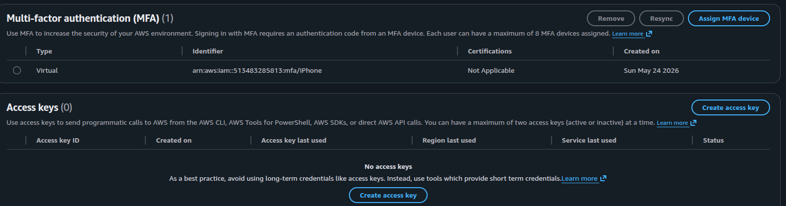
  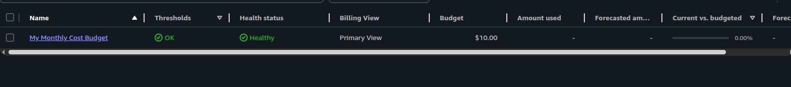
</p>
<p align="center">
  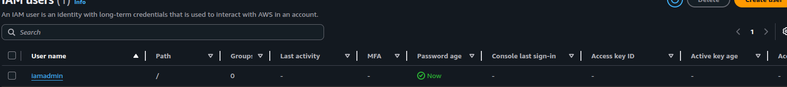
  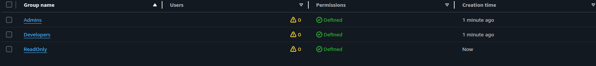
</p>

<p align="center">
  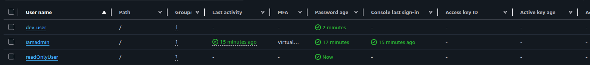
  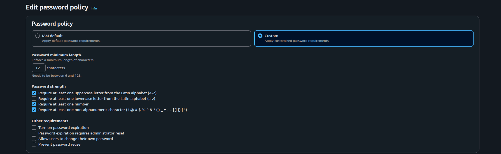
</p>
---

---

# ✅ Phase 2 — Custom VPC & Networking

## 📋 What This Phase Covers

The VPC (Virtual Private Cloud) is the networking foundation for everything
built in AWS. This phase builds a custom VPC from scratch — public and private
subnets, internet gateway, route tables, NAT gateway, and security groups.
Every EC2 instance, S3 endpoint, and CloudWatch resource in later phases
lives inside this VPC.

> Full VPC configuration reference: [`config/vpc-config.md`](config/vpc-config.md)

---

## 🔍 VPC Architecture

```
VPC: 10.0.0.0/16
│
├── Public Subnet (10.0.1.0/24) — ca-central-1a
│   ├── Internet Gateway attached
│   ├── Route: 0.0.0.0/0 → Internet Gateway
│   └── EC2 Windows Server (Phase 3)
│
└── Private Subnet (10.0.2.0/24) — ca-central-1b
    ├── No direct internet access
    ├── Route: 0.0.0.0/0 → NAT Gateway
    └── EC2 Linux Ubuntu (Phase 3)
```

---

## ⚙️ Part A — Create the Custom VPC

```
AWS Console → search "VPC" → Your VPCs → Create VPC
```

| Field                   | Value              |
| ----------------------- | ------------------ |
| **Resources to create** | VPC only           |
| **Name tag**            | `InfoTech-VPC`     |
| **IPv4 CIDR**           | `10.0.0.0/16`      |
| **IPv6**                | No IPv6 CIDR block |
| **Tenancy**             | Default            |

Click **Create VPC** ✅

---

## ⚙️ Part B — Create Subnets

Create two subnets — one public, one private — in different
availability zones for high availability.

```
VPC → Subnets → Create subnet
→ Select VPC: InfoTech-VPC
```

**Public Subnet:**

| Field                 | Value                    |
| --------------------- | ------------------------ |
| **Subnet name**       | `InfoTech-Public-Subnet` |
| **Availability Zone** | `ca-central-1a`          |
| **IPv4 CIDR**         | `10.0.1.0/24`            |

**Private Subnet:**

| Field                 | Value                     |
| --------------------- | ------------------------- |
| **Subnet name**       | `InfoTech-Private-Subnet` |
| **Availability Zone** | `ca-central-1b`           |
| **IPv4 CIDR**         | `10.0.2.0/24`             |

**Enable auto-assign public IP on the public subnet:**

```
Subnets → select InfoTech-Public-Subnet
→ Actions → Edit subnet settings
→ Enable auto-assign public IPv4 address → Save
```

---

## ⚙️ Part C — Create and Attach Internet Gateway

The Internet Gateway (IGW) allows resources in the public subnet
to communicate with the internet.

```
VPC → Internet gateways → Create internet gateway
```

| Field        | Value          |
| ------------ | -------------- |
| **Name tag** | `InfoTech-IGW` |

Click **Create** → then **Attach to VPC** → select `InfoTech-VPC` ✅

---

### ⚙️ Part D — Create Route Tables

Route tables control where traffic flows from each subnet.

**Public Route Table:**

```
VPC → Route tables → Create route table
```

| Field    | Value                |
| -------- | -------------------- |
| **Name** | `InfoTech-Public-RT` |
| **VPC**  | `InfoTech-VPC`       |

Add a route to send all internet traffic to the IGW:

```
Select InfoTech-Public-RT → Routes tab → Edit routes → Add route
Destination: 0.0.0.0/0
Target: InfoTech-IGW
Save changes
```

Associate with the public subnet:

```
Subnet associations tab → Edit subnet associations
→ Select: InfoTech-Public-Subnet → Save
```

**Private Route Table:**

```
Create route table
Name: InfoTech-Private-RT
VPC: InfoTech-VPC
```

Associate with the private subnet:

```
Subnet associations → Edit → Select: InfoTech-Private-Subnet → Save
```

> The private route table has no internet route by default.
> Traffic from private subnet goes through the NAT Gateway (Part E).

---

## ⚙️ Part E — Create NAT Gateway

The NAT Gateway allows instances in the private subnet to reach
the internet for updates — without exposing them to inbound traffic.

```
VPC → NAT gateways → Create NAT gateway
```

| Field                 | Value                                                   |
| --------------------- | ------------------------------------------------------- |
| **Name**              | `InfoTech-NAT-GW`                                       |
| **Subnet**            | `InfoTech-Public-Subnet` (NAT must be in public subnet) |
| **Connectivity type** | Public                                                  |
| **Elastic IP**        | Allocate Elastic IP → click Allocate                    |

Click **Create NAT gateway** — takes 1–2 minutes to become Available.

Once available, add the NAT route to the private route table:

```
Route tables → InfoTech-Private-RT → Routes → Edit routes → Add route
Destination: 0.0.0.0/0
Target: InfoTech-NAT-GW
Save changes
```

> ⚠️ **Cost note:** NAT Gateway charges approximately $0.045/hour.
> Delete it when not in use — recreate when needed.
> For Free Tier labs, stop the NAT Gateway between sessions.

---

## ⚙️ Part F — Create Security Groups

Security Groups act as virtual firewalls controlling inbound and
outbound traffic at the instance level.

**Security Group 1 — Windows EC2 (RDP access)**

```
VPC → Security groups → Create security group
```

| Field    | Value                 |
| -------- | --------------------- |
| **Name** | `InfoTech-Windows-SG` |
| **VPC**  | `InfoTech-VPC`        |

Inbound rules:

| Type | Protocol | Port | Source      | Purpose               |
| ---- | -------- | ---- | ----------- | --------------------- |
| RDP  | TCP      | 3389 | My IP       | Remote desktop access |
| ICMP | All      | All  | 10.0.0.0/16 | Internal ping         |

Outbound rules: Allow all (default) ✅

---

**Security Group 2 — Linux EC2 (SSH access)**

| Field    | Value               |
| -------- | ------------------- |
| **Name** | `InfoTech-Linux-SG` |
| **VPC**  | `InfoTech-VPC`      |

Inbound rules:

| Type | Protocol | Port | Source      | Purpose       |
| ---- | -------- | ---- | ----------- | ------------- |
| SSH  | TCP      | 22   | My IP       | SSH access    |
| ICMP | All      | All  | 10.0.0.0/16 | Internal ping |

Outbound rules: Allow all (default) ✅

---

## ⚙️ Part G — Enable VPC Flow Logs

VPC Flow Logs capture all network traffic in and out of the VPC —
useful for security monitoring and troubleshooting.

```
VPC → Your VPCs → select InfoTech-VPC
→ Flow logs tab → Create flow log
```

| Field           | Value                                              |
| --------------- | -------------------------------------------------- |
| **Filter**      | All                                                |
| **Destination** | CloudWatch Logs                                    |
| **Log group**   | `/aws/vpc/infotech-flow-logs` (create new)         |
| **IAM role**    | Create new role — allow VPC to write to CloudWatch |

> ⚠️ \*\*\* If Flow logs cannot be created there, please follow these steps:

```
Create It Manually in IAM
If the automatic option doesn't work, create it manually:

# Step 1 — Go to IAM

IAM → Roles → Create role

# Step 2 — Select trusted entity
Trusted entity type: AWS service
Use case: search "VPC Flow Logs" → select it → Next

# Step 3 — Attach permission policy

Search: CloudWatchLogsFullAccess → Check it → Next

# Step 4 — Name and create

| Field           | Value                                      |
| --------------- | -------------------------------------------|
| Role name       | VPCFlowLogsRole                            |
| Description     | Allows VPC Flow Logs to write to CloudWatch|

Click Create role ✅

# Step 5 — Go back to VPC Flow Logs

VPC → Your VPCs → InfoTech-VPC
→ Flow logs → Create flow log
→ IAM role dropdown → select VPCFlowLogsRole

# If You Can't Find "VPC Flow Logs" as a Use Case
# Some AWS accounts don't show it directly. In that case:

Step 2 → select "EC2" as use case → Next
→ After creating the role, go back and edit the Trust Policy

IAM → Roles → VPCFlowLogsRole
→ Trust relationships tab → Edit trust policy
→ Replace "ec2.amazonaws.com" with "vpc-flow-logs.amazonaws.com"
→ Update policy

```

---

## ✅ Outcome

- Custom VPC `InfoTech-VPC` created — `10.0.0.0/16` ✅
- Public subnet `10.0.1.0/24` in `ca-central-1a` ✅
- Private subnet `10.0.2.0/24` in `ca-central-1b` ✅
- Internet Gateway created and attached to VPC ✅
- Public route table — routes internet traffic via IGW ✅
- Private route table — routes outbound traffic via NAT Gateway ✅
- NAT Gateway created in public subnet ✅
- Security Group for Windows EC2 — RDP on port 3389 ✅
- Security Group for Linux EC2 — SSH on port 22 ✅
- VPC Flow Logs enabled — sending to CloudWatch ✅

---

## 📸 Screenshots

<p align="center">
  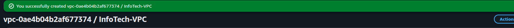
  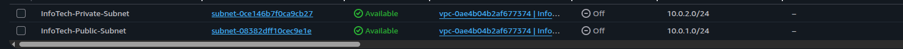
</p>
<p align="center">
  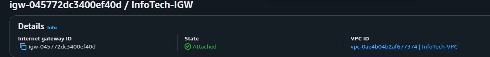
  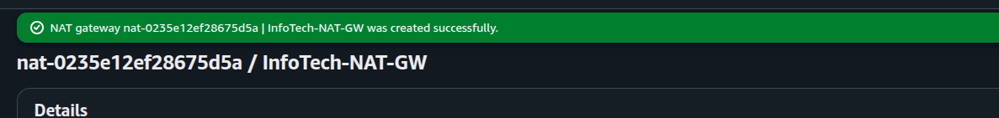
</p>

<p align="center">
  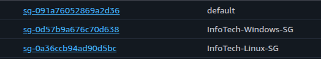
  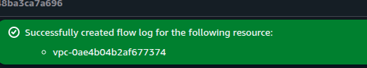
</p>

---

# ✅ Phase 3 — EC2 Compute Instances

## 📋 What This Phase Covers

EC2 (Elastic Compute Cloud) is AWS's virtual machine service. This phase
launches two instances inside the VPC built in Phase 2 — a Windows Server
in the public subnet accessed via RDP, and a Ubuntu Linux server in the
private subnet accessed via SSH. Both are `t2.micro` which are Free Tier eligible.

> Full EC2 configuration reference: [`config/ec2-config.md`](config/ec2-config.md)

---

## 🔍 Instance Architecture

```
Public Subnet (10.0.1.0/24)          Private Subnet (10.0.2.0/24)
─────────────────────────────         ──────────────────────────────
EC2: InfoTech-Windows-Server          EC2: InfoTech-Linux-Server
AMI: Windows Server 2022              AMI: Ubuntu 22.04 LTS
Type: t2.micro                        Type: t2.micro
Access: RDP (port 3389)               Access: SSH (port 22)
SG: InfoTech-Windows-SG               SG: InfoTech-Linux-SG
Public IP: Yes (auto-assigned)        Public IP: No
Internet: Via IGW                     Internet: Via NAT Gateway
```

---

## ⚙️ Part A — Create a Key Pair

A key pair is required to connect to both instances — used to decrypt
the Windows password and to authenticate SSH on Linux.

```
EC2 → Key Pairs → Create key pair
```

| Field                  | Value                                                   |
| ---------------------- | ------------------------------------------------------- |
| **Name**               | `InfoTech-KeyPair`                                      |
| **Key pair type**      | RSA                                                     |
| **Private key format** | `.pem` (for Linux/Mac) or `.ppk` (for PuTTY on Windows) |

Click **Create key pair** → the `.pem` file downloads automatically.

> ⚠️ Save this file somewhere safe. If you lose it you cannot
> connect to your instances and will need to recreate them.
> Store it at: `C:\Users\YourName\.ssh\InfoTech-KeyPair.pem`

---

## ⚙️ Part B — Launch Windows Server EC2

```
EC2 → Instances → Launch instances
```

**Step 1 — Name and AMI**

| Field            | Value                     |
| ---------------- | ------------------------- |
| **Name**         | `InfoTech-Windows-Server` |
| **AMI**          | Windows Server 2022 Base  |
| **Architecture** | 64-bit (x86)              |

**Step 2 — Instance type**

| Field             | Value                           |
| ----------------- | ------------------------------- |
| **Instance type** | `t2.micro` (Free Tier eligible) |

**Step 3 — Key pair**

| Field        | Value              |
| ------------ | ------------------ |
| **Key pair** | `InfoTech-KeyPair` |

**Step 4 — Network settings**

| Field                     | Value                                  |
| ------------------------- | -------------------------------------- |
| **VPC**                   | `InfoTech-VPC`                         |
| **Subnet**                | `InfoTech-Public-Subnet`               |
| **Auto-assign public IP** | Enable                                 |
| **Security group**        | Select existing: `InfoTech-Windows-SG` |

**Step 5 — Storage**

| Field           | Value                                |
| --------------- | ------------------------------------ |
| **Root volume** | 30 GB gp2 (Free Tier includes 30 GB) |

Click **Launch instance** ✅

---

## ⚙️ Part C — Launch Ubuntu Linux EC2

```
EC2 → Instances → Launch instances
```

**Step 1 — Name and AMI**

| Field            | Value                   |
| ---------------- | ----------------------- |
| **Name**         | `InfoTech-Linux-Server` |
| **AMI**          | Ubuntu Server 22.04 LTS |
| **Architecture** | 64-bit (x86)            |

**Step 2 — Instance type**

| Field             | Value                           |
| ----------------- | ------------------------------- |
| **Instance type** | `t2.micro` (Free Tier eligible) |

**Step 3 — Key pair**

| Field        | Value                              |
| ------------ | ---------------------------------- |
| **Key pair** | `InfoTech-KeyPair` (same key pair) |

**Step 4 — Network settings**

| Field                     | Value                                |
| ------------------------- | ------------------------------------ |
| **VPC**                   | `InfoTech-VPC`                       |
| **Subnet**                | `InfoTech-Private-Subnet`            |
| **Auto-assign public IP** | Disable                              |
| **Security group**        | Select existing: `InfoTech-Linux-SG` |

**Step 5 — Storage**

| Field           | Value    |
| --------------- | -------- |
| **Root volume** | 8 GB gp2 |

Click **Launch instance** ✅

---

## ⚙️ Part D — Connect to Windows Server via RDP

Wait 3–5 minutes for the Windows instance to fully initialise.

**Step 1 — Get the Windows password**

```
EC2 → Instances → select InfoTech-Windows-Server
→ Actions → Security → Get Windows password
→ Upload your InfoTech-KeyPair.pem file
→ Click Decrypt password
→ Copy the password shown
```

**Step 2 — Get the public IP**

```
EC2 → Instances → InfoTech-Windows-Server
→ Copy the Public IPv4 address
```

**Step 3 — Connect via RDP**

Open **Remote Desktop Connection** on your computer:

```
Computer: <Public IPv4 address>
Username: Administrator
Password: <decrypted password from Step 1>
```

Click **Connect** → accept the certificate warning → you should see
the Windows Server desktop ✅

---

## ⚙️ Part E — Connect to Linux Server via SSH

The Linux instance is in the private subnet — no public IP.
Connect to it through the Windows instance (bastion host pattern)
or temporarily add a public IP for testing.

**Option 1 — SSH from your local machine via SSM (Session Manager)**

```
EC2 → Instances → InfoTech-Linux-Server
→ Connect → Session Manager tab → Connect
```

This opens a browser-based terminal directly — no SSH key needed.
Requires the SSM agent (pre-installed on Ubuntu 22.04).

**Option 2 — SSH from Windows Server (bastion host)**

Copy your `.pem` key to the Windows Server, then SSH from there:

```powershell
# On Windows Server (after RDP connection)
# Open PowerShell

ssh -i "C:\InfoTech-KeyPair.pem" ubuntu@10.0.2.x
# Replace 10.0.2.x with the Linux instance's private IP
```

Get the private IP:

```
EC2 → Instances → InfoTech-Linux-Server
→ Private IPv4 address (e.g. 10.0.2.45)
```

---

## ⚙️ Part F — Verify Connectivity

**On the Windows Server (via RDP):**

```powershell
# Test internet connectivity
ping google.com

# Check Windows version
winver

# Check private IP
ipconfig

# Test connectivity to Linux server
ping 10.0.2.x    # replace with Linux private IP
```

**On the Linux Server (via SSH or Session Manager):**

```bash
# Test outbound internet via NAT Gateway
ping google.com -c 4

# Check Ubuntu version
lsb_release -a

# Check private IP
ip addr show

# Update packages (confirms NAT Gateway is working)
sudo apt update
```

---

## ⚙️ Part G — Stop Instances When Not in Use

> ⚠️ Free Tier gives 750 hours/month per instance type.
> With two t2.micro instances running 24/7 that is 1,440 hours/month —
> which exceeds the Free Tier. **Stop instances when not actively using them.**

```
EC2 → Instances → select both instances
→ Instance state → Stop instance
```

Stopped instances do not accrue compute charges.
EBS storage still charges — but 30 GB is within Free Tier.

To restart:

```
EC2 → Instances → select instance
→ Instance state → Start instance
```

> Note: Public IP changes every time the instance restarts unless
> you assign an Elastic IP (covered in Phase 6).

---

## ✅ Outcome

- Key pair `InfoTech-KeyPair` created and saved securely ✅
- Windows Server 2022 EC2 launched in public subnet ✅
- Ubuntu 22.04 EC2 launched in private subnet ✅
- RDP connection to Windows Server confirmed ✅
- SSH connection to Linux Server confirmed ✅
- Ping between both instances successful — internal connectivity ✅
- Internet connectivity verified on both instances ✅
- NAT Gateway confirmed working — Linux can reach internet ✅
- Both instances stopped when not in use ✅

---

## 📸 Screenshots

<p align="center">
  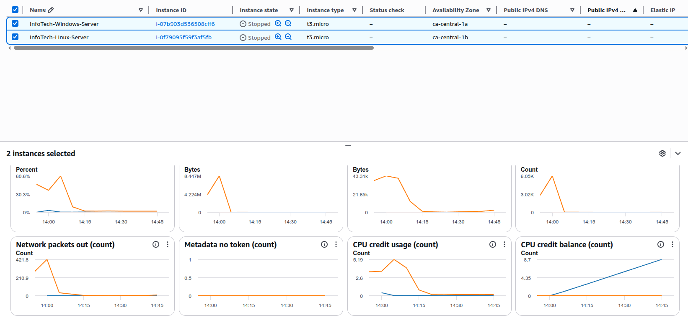
 
</p>

# ✅ Phase 4 — S3 Storage

## 📋 What This Phase Covers

S3 (Simple Storage Service) is AWS's object storage — used for backups,
logs, static files, application assets, and data archiving. This phase
creates two S3 buckets, configures bucket policies, enables versioning,
sets up lifecycle rules, and tests uploading and downloading objects.
S3 is one of the most used AWS services in real IT environments.

> Full S3 configuration reference: [`config/s3-config.md`](config/s3-config.md)

---

## 🗂️ Bucket Design

```
infotech-lab-bucket          ← Main lab bucket (private)
│ ├── /logs/                 ← EC2 and VPC flow logs
│ ├── /backups/              ← Simulated server backups
│ └── /configs/              ← Configuration file storage
│
infotech-static-bucket       ← Static website hosting (public)
  └── index.html             ← Simple hosted webpage
```

---

## ⚙️ Part A — Create the Main S3 Bucket

```
AWS Console → search "S3" → Create bucket
```

| Field                   | Value                           |
| ----------------------- | ------------------------------- |
| **Bucket name**         | `infotech-lab-bucket-yourname`  |
| **AWS Region**          | `ca-central-1`                  |
| **Object Ownership**    | ACLs disabled (recommended)     |
| **Block Public Access** | Block all public access ✅      |
| **Bucket Versioning**   | Enable                          |
| **Default encryption**  | SSE-S3 (Amazon S3 managed keys) |

Click **Create bucket** ✅

> ⚠️ S3 bucket names are **globally unique** across all AWS accounts.
> If `infotech-lab-bucket` is taken, add your name or a number:
> `infotech-lab-bucket-sagar` or `infotech-lab-bucket-2026`

---

## ⚙️ Part B — Create Folder Structure

```
Click on infotech-lab-bucket
→ Create folder
```

Create three folders:

| Folder     | Purpose                          |
| ---------- | -------------------------------- |
| `logs/`    | Store VPC flow logs and EC2 logs |
| `backups/` | Simulated server backup files    |
| `configs/` | Configuration file storage       |

---

## ⚙️ Part C — Upload Test Files

Test uploading objects to each folder:

```
S3 → infotech-lab-bucket → logs/ folder
→ Upload → Add files
→ Upload any small text file (e.g. create a test.txt)
```

Create a quick test file on your local machine:

```
test.txt content:
"InfoTech Lab — S3 test upload — 2026"
```

Upload to each folder to confirm uploads work ✅

**Verify the upload:**

```
Click on the uploaded file
→ Note: Object URL, Size, Last modified, Storage class
→ Click "Open" — confirms download works
```

---

## ⚙️ Part D — Configure a Bucket Policy

A bucket policy controls who can access the bucket and what actions
they can perform. Add a policy that denies all access unless using HTTPS:

```
S3 → infotech-lab-bucket → Permissions tab
→ Bucket policy → Edit
```

Paste this policy (replace `YOUR-BUCKET-NAME` with your actual bucket name):

```json
{
  "Version": "2012-10-17",
  "Statement": [
    {
      "Sid": "DenyNonHTTPS",
      "Effect": "Deny",
      "Principal": "*",
      "Action": "s3:*",
      "Resource": [
        "arn:aws:s3:::YOUR-BUCKET-NAME",
        "arn:aws:s3:::YOUR-BUCKET-NAME/*"
      ],
      "Condition": {
        "Bool": {
          "aws:SecureTransport": "false"
        }
      }
    }
  ]
}
```

Click **Save changes** ✅

This enforces encryption in transit — all HTTP requests are denied,
only HTTPS allowed. Standard security best practice.

---

## ⚙️ Part E — Enable Versioning and Test It

Versioning keeps every version of every object — useful for recovery
from accidental deletion or overwrite.

Versioning was enabled in Part A. Test it now:

```
1. Upload test.txt to backups/ folder
2. Modify the file content locally: "InfoTech Lab — version 2"
3. Upload the same filename again
4. In S3 → toggle "Show versions" on
5. You should see both versions of the file
6. Click an older version → confirm you can download it
```

**Recovery test — delete and restore:**

```
1. Delete the latest version of test.txt
2. Toggle "Show versions" → find the delete marker
3. Delete the delete marker → file is restored ✅
```

---

## ⚙️ Part F — Configure Lifecycle Rules

Lifecycle rules automatically move or delete objects based on age —
reducing storage costs without manual intervention.

```
S3 → infotech-lab-bucket → Management tab
→ Lifecycle rules → Create lifecycle rule
```

**Rule 1 — Archive old logs**

| Field          | Value                         |
| -------------- | ----------------------------- |
| **Rule name**  | `archive-old-logs`            |
| **Scope**      | Limit to: `logs/` prefix      |
| **Transition** | Move to Glacier after 30 days |
| **Expiration** | Delete after 365 days         |

**Rule 2 — Clean up old backups**

| Field              | Value                                 |
| ------------------ | ------------------------------------- |
| **Rule name**      | `expire-old-backups`                  |
| **Scope**          | Limit to: `backups/` prefix           |
| **Expiration**     | Delete current versions after 90 days |
| **Delete markers** | Clean up expired delete markers       |

Click **Create rule** for each ✅

---

## ⚙️ Part G — Create a Static Website Bucket

Create a second bucket for static website hosting — this makes S3
serve a simple HTML page publicly, a common use case in real environments.

```
S3 → Create bucket
```

| Field                   | Value                            |
| ----------------------- | -------------------------------- |
| **Bucket name**         | `infotech-static-yourname`       |
| **Region**              | `ca-central-1`                   |
| **Block Public Access** | Uncheck — allow public access ✅ |
| **Acknowledge**         | Check the warning checkbox       |

**Enable static website hosting:**

```
infotech-static-yourname → Properties tab
→ Static website hosting → Edit
→ Enable
→ Index document: index.html
→ Save changes
```

**Create and upload index.html:**

Create a file called `index.html` with this content:

```html
<!DOCTYPE html>
<html>
  <head>
    <title>InfoTech Lab</title>
  </head>
  <body>
    <h1>InfoTech AWS Lab</h1>
    <p>Static website hosted on Amazon S3</p>
    <p>Project: AWS Cloud Infrastructure Lab</p>
  </body>
</html>
```

Upload it to the root of `infotech-static-yourname`.

**Add a bucket policy to allow public read:**

```
Permissions → Bucket policy → Edit
```

```json
{
  "Version": "2012-10-17",
  "Statement": [
    {
      "Sid": "PublicReadAccess",
      "Effect": "Allow",
      "Principal": "*",
      "Action": "s3:GetObject",
      "Resource": "arn:aws:s3:::infotech-static-yourname/*"
    }
  ]
}
```

**Test the website:**

```
Properties → Static website hosting → copy the Bucket website endpoint
→ Open in browser → your HTML page loads ✅
```

---

## ✅ Outcome

- Main bucket `infotech-lab-bucket` created — private, encrypted ✅
- Folder structure created — logs, backups, configs ✅
- Test files uploaded and downloaded successfully ✅
- Bucket policy enforcing HTTPS-only access ✅
- Versioning enabled — version recovery tested ✅
- Lifecycle rules configured — archive logs after 30 days ✅
- Static website bucket created and publicly accessible ✅
- HTML page served from S3 bucket website endpoint ✅

---

## 📸 Screenshots

<p align="center">
  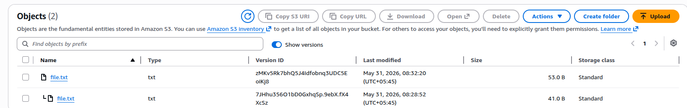
         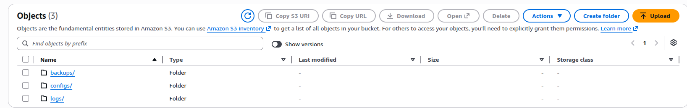
 
</p>
<p align="center">
  
         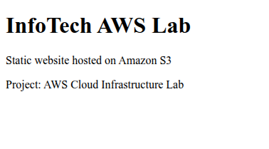
 
</p>
<p align="center">
  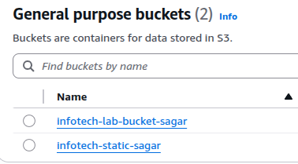
         
 
</p>
---
